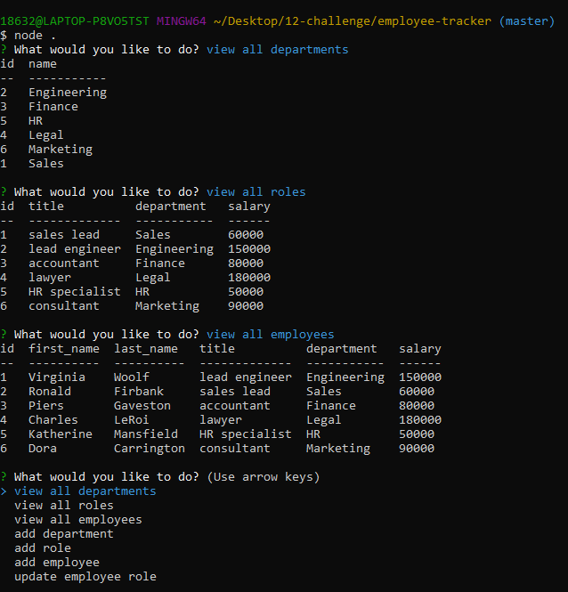

 # **Employee Tracker**

  

  ## **Table of Contents** 
  * [Description](#Description)
  * [Installation](#Installation)
  * [Usage](#Usage)
  * [Contributions](#Contributions)
  * [Questions](#Questions)

  ## Description 
  This app allows you to view and add departments, roles and employees. It is meant to store information and keep information organized for your convinience. 

  ## Installation
  Open mysql and source schema.sql and seeds.sql then run node.js

  ## Usage 
  [employee-tracker example video](https://drive.google.com/file/d/1lI5KeksRQoDtcn4VhJZiEKWoipKufYhM/view)
  
  

  ## Contributions 
  Contributions are welcome. 
  Please submit a pull request or GitHub issue for any major changes. 
  
 ## Questions 
 For any questions or issues, please email carolinaccez@gmail.com or visit github.com/carolinacez. 